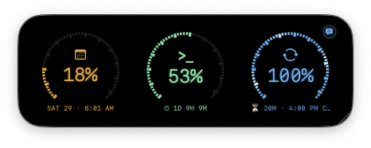
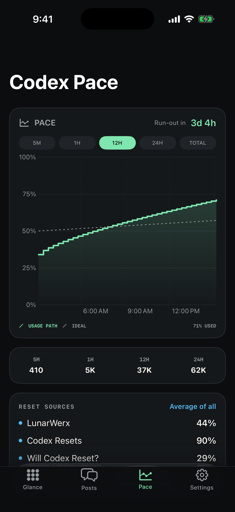
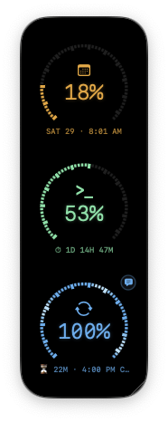
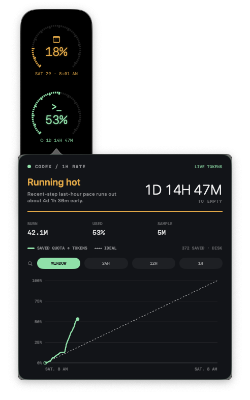
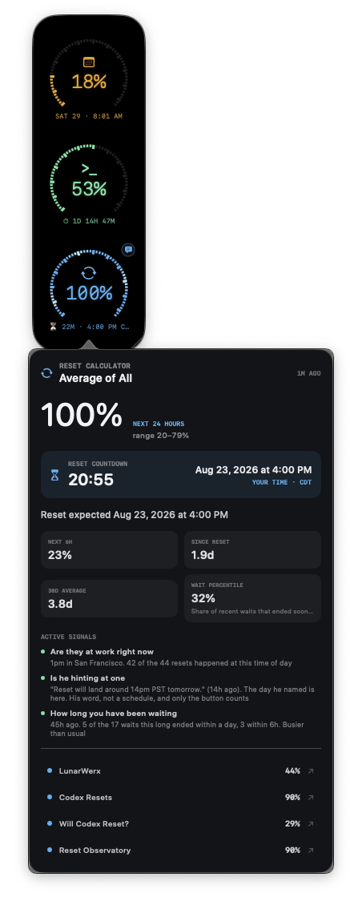
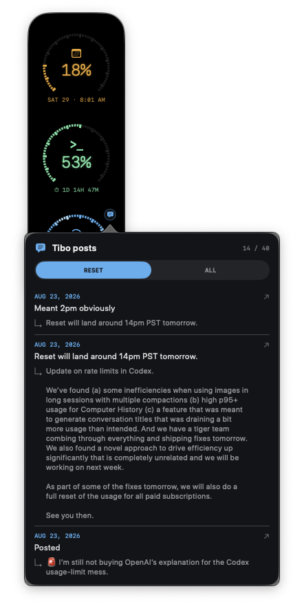
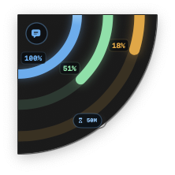
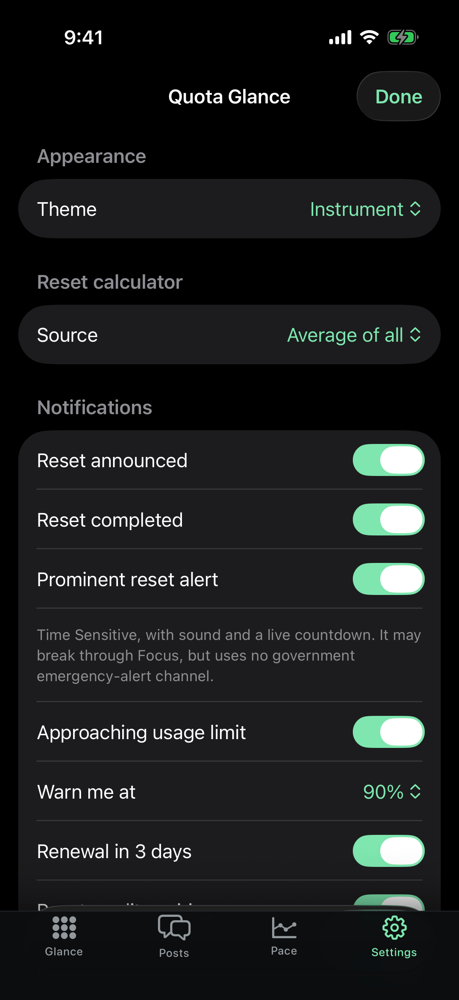

# Quota Glance

<p align="center">
  <strong>A native Codex quota dashboard for Mac and iPhone.</strong><br>
  See the week, usage pace, reset signals, and upcoming reset countdowns without opening a browser.
</p>

<p align="center">
  
  <br><br>
  
  &nbsp;&nbsp;&nbsp;
  
</p>

> [!NOTE]
> Quota Glance is an unofficial community project. It is not affiliated with or endorsed by OpenAI or X.

## What it does

### macOS

- Shows three glanceable meters: calendar progress, Codex usage, and estimated reset progress.
- Floats above normal windows, resizes between vertical and horizontal layouts, and mounts as a compact ring on screen edges or corners.
- Tracks a bounded local usage history and estimates run-out time over 5-minute, 1-hour, 12-hour, 24-hour, or total windows.
- Combines public reset calculators and can surface the first newly detected reset-related post without duplicating it across providers.
- Displays future reset announcements as a local-time countdown.
- Offers multiple visual themes, launch-at-login, billing-cycle reminders, and manual refresh controls.

### iPhone

- Mirrors the three-ring glance dashboard and supports Home Screen and Lock Screen widgets.
- Includes pace charts, provider details, reset posts and replies, themes, and notification controls.
- Starts a Live Activity for an announced reset countdown.
- Supports Time Sensitive notifications for reset announcements and completed resets.
- Syncs through the user's private CloudKit database—there is no shared backend or shared login.

## macOS in detail

<table>
  <tr>
    <td align="center" width="50%">
      <br>
      <sub><strong>Vertical dashboard</strong><br>Three meters, live run-out pace, reset countdown, and posts at a glance.</sub>
    </td>
    <td align="center" width="50%">
      <br>
      <sub><strong>Horizontal dashboard</strong><br>The same information in a low-profile desktop layout.</sub>
    </td>
  </tr>
  <tr>
    <td align="center">
      <br>
      <sub><strong>Live token pace</strong><br>Saved quota and token history, selectable time windows, ideal pace, burn, and time-to-empty.</sub>
    </td>
    <td align="center">
      <br>
      <sub><strong>Reset intelligence</strong><br>Local-time countdown, active signals, wait statistics, and every provider side by side.</sub>
    </td>
  </tr>
  <tr>
    <td align="center">
      <br>
      <sub><strong>Reset post feed</strong><br>Reset-only or all-post filters with reply context and cross-provider deduplication.</sub>
    </td>
    <td align="center">
      <br>
      <sub><strong>Mounted corner mode</strong><br>Drag to a screen edge or corner for a compact three-ring view.</sub>
    </td>
  </tr>
</table>

## iPhone companion

<p align="center">
  
  
  
  
</p>

<p align="center"><sub>Preview data is used in the iPhone screenshots.</sub></p>

## Data and privacy

Quota Glance is designed to be self-hosted by the person using it:

- Codex usage is read on the Mac from the user's local Codex/ChatGPT session. Credentials are not copied into the project.
- Usage checkpoints are stored in Application Support, compacted, and pruned after their useful reset window.
- Billing capture uses a local WebKit session. Cookies and Keychain items stay in the user's macOS profile.
- Phone sync uses the user's **private** CloudKit database and app group.
- Public reset estimates and public posts come from third-party reset calculators; availability and accuracy can vary.

This repository intentionally excludes build folders, app caches, usage history, browser data, signing certificates, provisioning profiles, Apple team IDs, and developer-specific bundle identifiers.

## Requirements

- macOS 13 or later
- iOS 17 or later for the companion app
- Xcode with an Apple development team configured
- [XcodeGen](https://github.com/yonaskolb/XcodeGen)
- Codex CLI or the ChatGPT desktop app signed into the account whose quota you want to observe

## Configure your fork

The checked-in projects use placeholder identifiers under `com.example`. Before signing or enabling sync, replace these consistently with identifiers owned by your Apple Developer account:

| Capability | Placeholder |
|---|---|
| macOS app | `com.example.quotaglance` |
| iOS app | `com.example.quotaglance.mobile` |
| Widget extension | `com.example.quotaglance.mobile.widgets` |
| App group | `group.com.example.quotaglance` |
| CloudKit container | `iCloud.com.example.quotaglance` |

Update the values in both `project.yml` files, the entitlements, and the custom configuration keys in the app/widget Info plists. Create the matching App Group and CloudKit container in the Apple Developer portal, then select your development team in Xcode. Both apps must use the same CloudKit container for private sync.

No API key, shared account, or maintainer-owned backend is required.

## Build

```bash
brew install xcodegen

cd macOS
xcodegen generate --spec mac-project.yml
open QuotaGlanceMac.xcodeproj
```

```bash
cd iOS
xcodegen generate
open QuotaGlanceMobile.xcodeproj
```

Select your team and matching capabilities in Xcode, then run the macOS and iOS schemes. For TestFlight, archive the iOS scheme and distribute it through App Store Connect under your own developer account.

## Test

```bash
cd macOS
swift test
```

After generating the iOS project, run the test scheme on an available simulator:

```bash
xcodebuild test \
  -project QuotaGlanceMobile.xcodeproj \
  -scheme QuotaGlanceMobile \
  -destination 'platform=iOS Simulator,name=iPhone 17 Pro' \
  CODE_SIGNING_ALLOWED=NO
```

## Reset sources

The provider layer can read public information from:

- [codex-resets.com](https://codex-resets.com)
- [Will Codex Quota Reset?](https://www.willcodexquotareset.com)
- [Gussuriworks Codex Reset](https://codex.gussuriworks.com/en)
- [LunarWerx Codex Reset](https://codex.lunarwerx.com)

Quota Glance can use one provider or average the available estimates. Provider output is informational and is never guaranteed to match an official account limit.

## Contributing

Bug reports and focused pull requests are welcome. Please keep account data, screenshots containing private desktop content, signing files, and generated build products out of commits.

## License

[MIT](LICENSE)
