# Quota Glance

<p align="center">
  <strong>A native Codex and Claude quota dashboard for Mac and iPhone.</strong><br>
  Keep quotas in view with pet widgets, edge meters, and playful desktop visits.
</p>

<p align="center">
  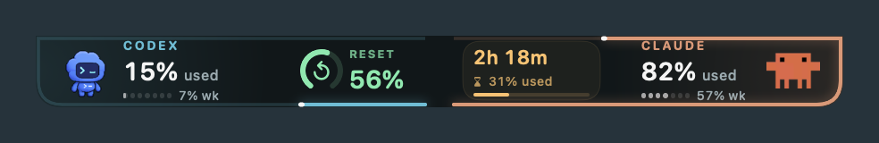
  <br><br>
  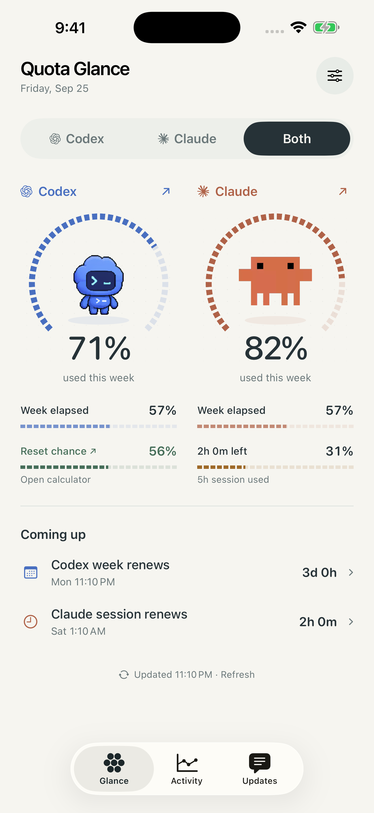
  &nbsp;&nbsp;&nbsp;
  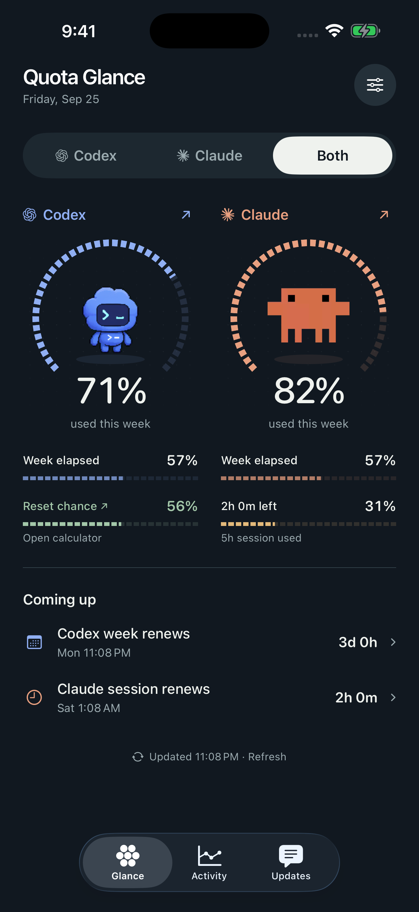
</p>

> [!NOTE]
> Quota Glance is an unofficial community project. It is not affiliated with or endorsed by OpenAI, Anthropic, or X.

## What it does

### macOS

- Choose **Codex / Claude / Both** in **Layout… → Show**. The choice persists across launches and applies to all thirteen views, the menu bar, pets, and rides. Single-provider views shrink to fit and use only that provider’s pet.
- Offers thirteen views in **Layout…**, grouped into Floating, Screen edges, Dock corners, and In motion. The slim 40-point pet notch joins redesigned Twin dials (portholes), Stacked slate (overlapping tickets), Metric matrix (quota arcade), and Corner blade (an edge bookmark). Each stats surface shows weekly usage, week progress, and Codex reset chance or Claude session usage/countdown.
- **Shuffle layouts** rotates through all thirteen views every **1 minute**, **1 hour**, or **1 day**. It remembers the remaining layouts and next change across launches, pauses while hidden, and waits for an open pet popup or drag to finish. **Next** switches immediately; choosing a specific layout turns Shuffle off.
- Adds **Screen buddies** (pets hanging from the screen edges; click to greet and open stats), **Peekaboo** (alternating ten-second side visits with its own timing control), **Fly-by** (a plane towing rippling cloth stats), **Balloon ride** (a floating basket with a hanging banner), and **Skateboard parade** (a rolling, bouncing deck). **Wave now / Show now** previews the selected companion behavior.
- Uses the actual bundled Codex and Clawd artwork. Reduce Motion keeps pets still and parks the fly-by banner. Dragging steers a ride, releasing carries momentum, and clicking opens the selected providers’ details. Visit controls offer back-to-back, every 45 seconds (default), or every two minutes; Peekaboo saves its own timing. Only the vehicle and banner catch clicks; open pop-ups hold the visit. Moving under the pointer never stops a ride, and the cloth ripple stays subtle. Hide, switching layouts, changing displays, and quitting cancel visits and timers. Tibo bubbles stay to the left of Codex in the notch.
- Adds compact **Split corner dials**, **Dock perches**, and **Corner arcs**, with one provider at each bottom edge. Their 100-point-wide footprints stay anchored to the physical screen corners, leaving the desktop between the two windows clickable.
- **Layout… → On reset** lets Codex and Claude choose separate celebrations: **Loop-the-loop**, **Token cannonball**, **Special delivery**, **Popcorn party**, **Bubble bounce**, **Token garden**, **Treasure dive**, **Shuffle**, or **Off**. Shuffle gives each of the seven scenes a turn in a random order for each pet; short original sound effects follow the action, with one shared sound toggle. Previews use the real pets; live celebrations require a confirmed fresh reset and ignore cached readings, account changes, and repeated observations. Claude supports weekly and session refills. The overlay passes clicks through and respects Reduce Motion.
- Keeps the main menu to show/hide, Layout, Refresh, Codex, Advanced, and Quit. **Codex → Reset calculator…** and reset automation apply only to Codex. Claude has usage, refresh, and its app-owned sign-in; the working WebKit connection is reused.
- Retires the old Codex-only dashboard, mounted-ring layouts, theme controls, and dense menu-bar panel. The menu bar uses the same compact quota tickets as the desktop. Codex’s reset calculator remains available whenever Codex is shown.
- Tracks bounded local Codex and Claude percentage histories, with graphs, previous quota weeks, and pace estimates. Claude records verified provider measurements in its existing local cache; account changes and quota resets keep histories separate.
- Combines public reset calculators and can surface the first newly detected reset-related post without duplicating it across providers.
- Runs data collection outside widget windows, preserving cache updates, account connections, history, and private iPhone sync. Launch at login and manual refresh remain available.

### iPhone

- Rebuilt around **Glance**, **Activity**, and **Updates**. Glance places the real pets inside segmented weekly gauges with aligned week-progress and Codex reset-chance or Claude session meters. Choose Codex, Claude, or Both; Claude’s session emphasizes hours and minutes remaining.
- **Settings → Accounts** connects directly to OpenAI and Claude using separate sign-ins on the phone. The phone collects its own quota history and pace; **Include Mac history & tasks** is optional and off by default.
- Includes redesigned small and medium **Home Screen companions**, plus circular, rectangular, and inline **Lock Screen widgets**. Both widget kinds keep their existing identifiers and follow the app’s provider selection. Pet dials, paired meters, and countdowns share the app’s light/dark palette.
- Alerts for Claude weekly and five-hour limits at the chosen threshold, once per window, plus confirmed new weekly allowances. Stale readings never trigger Claude alerts.
- Records Codex and Claude usage percentages for interactive calendars, pace ranges, and previous quota weeks. Claude’s graph is available in Activity and its pet details, using its own account and quota window. Collection starts from real provider measurements; account changes and resets keep each history separate. Expandable Tibo posts and replies and focused notification controls remain available. The phone follows system light/dark appearance.
- **Follow active providers** starts a usage Live Activity after recent quota increases and considers each provider active for six minutes after an increase. It shows both when both are active, independently of the app’s provider selector. First connections, resets, and account changes do not count as activity. An app refresh ends a quiet activity; if iOS has suspended the app, its Lock Screen card becomes stale and offers **Open to refresh**.
- With one active provider, the compact Dynamic Island shows its pet and weekly percentage on the left and estimated weekly quota time remaining on the right. With both active, each side shows one pet and percentage. Pace appears after enough recorded usage and stays separate from the reset countdown.
- Pets hop when readings change. Confirmed resets can send Codex through a confetti loop or Claude into a token pool; both scenes have previews in **Settings → Pet animations**. Live Activities use short transitions when data updates and respect Reduce Motion and the always-on display.
- Also supports a Live Activity for an announced reset countdown.
- Supports Time Sensitive notifications for reset announcements and completed resets.
- Refreshes directly while open and when iOS grants background time. Live Activities cannot fetch usage themselves; continuous updates while the app is closed require a push service, which is not included. Optional Mac details sync through the user's private CloudKit database.

## macOS in detail

Production SwiftUI previews below use sample data.

| Both providers | Claude only | Codex only |
| --- | --- | --- |
|  | 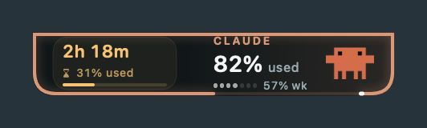 | 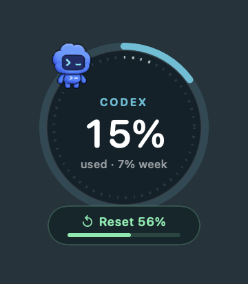 |

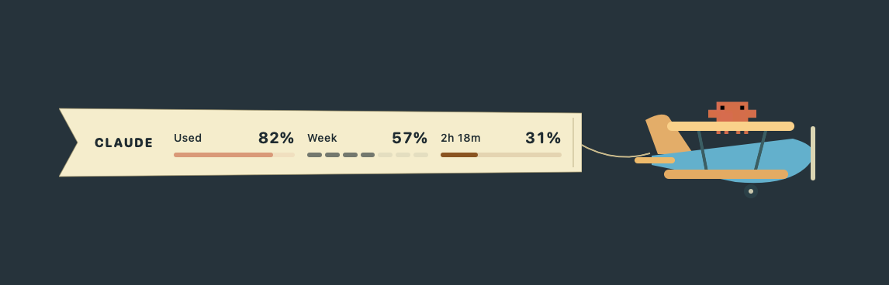

Every layout uses the same provider selector. Codex keeps its reset percentage; Claude keeps its five-hour percentage with hours and minutes remaining. The 40-point notch, gentle cloth ripple, click-and-drag interaction, and visit frequency carry through all provider modes.

### Dock corners and refill celebrations

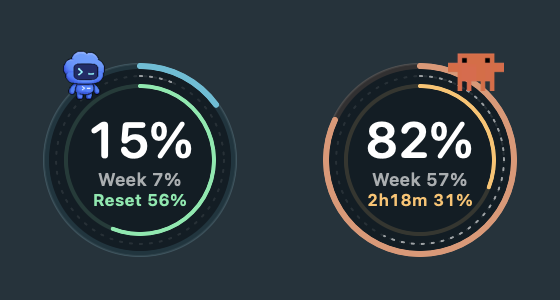

In use, the two dials sit in separate physical bottom corners beside the Dock. Perches and curved corner meters share the same bottom-edge anchors.

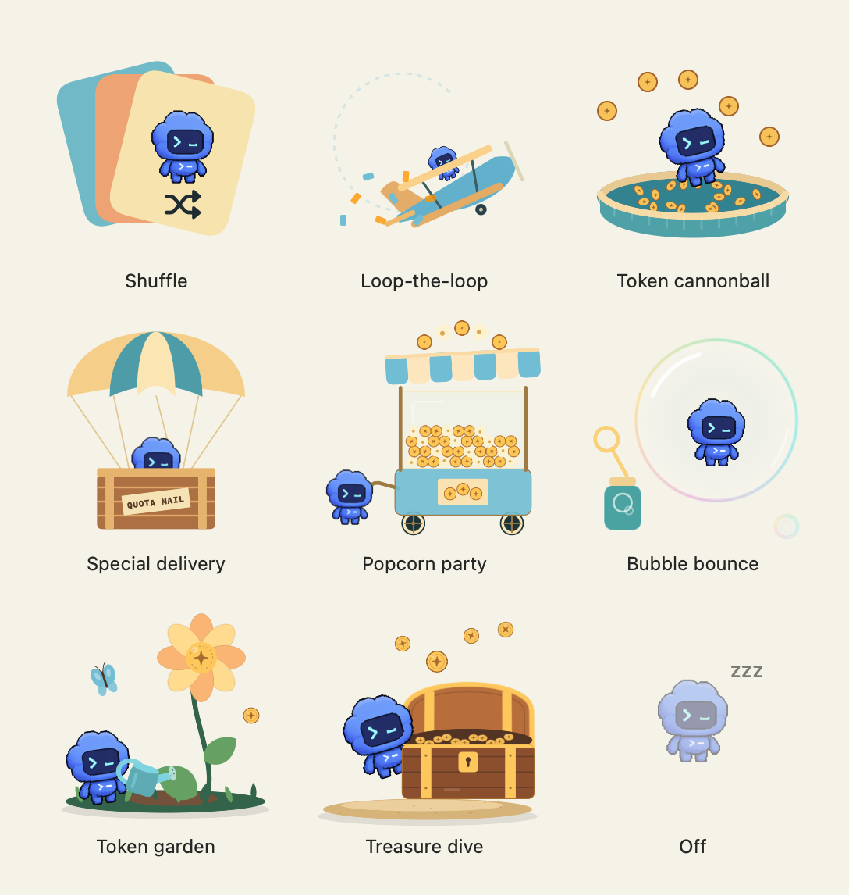

Choose and preview a different reset animation for each provider in **Layout… → On reset**, or choose **Shuffle** for a different surprise each time. **Sound effects** turns all celebration audio on or off.

## iPhone companion

<p align="center">
  
  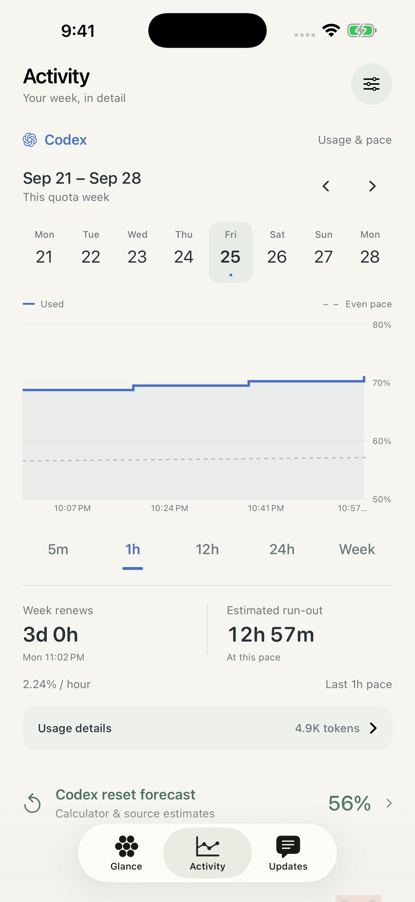
  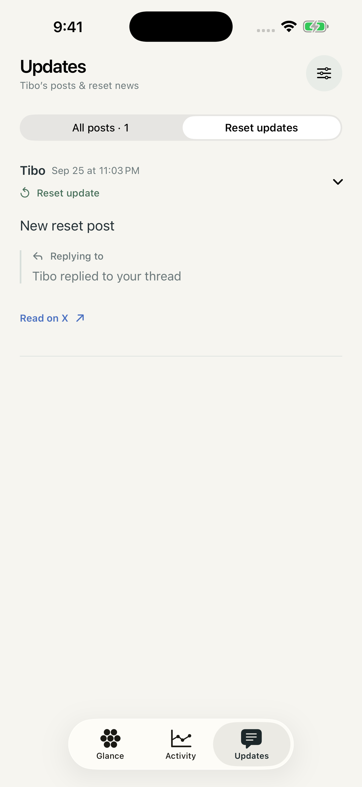
</p>

<p align="center">
  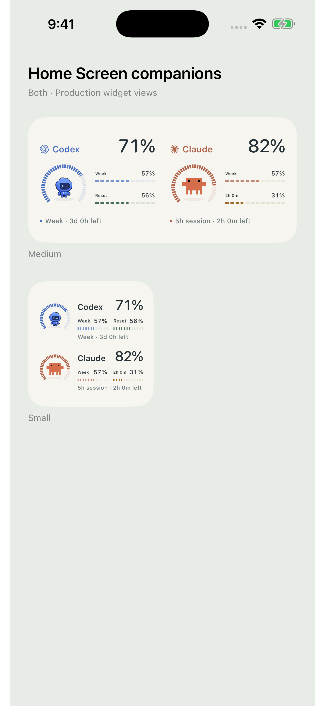
  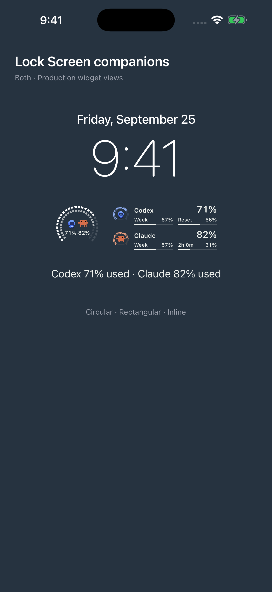
</p>

<p align="center"><sub>Preview data is used in the iPhone screenshots.</sub></p>

## Data and privacy

Quota Glance is designed to be self-hosted by the person using it:

- On the Mac, Codex usage is read from the user's local Codex/ChatGPT session. Credentials are not copied into the project.
- On the Mac, Claude can use an app-owned web session via **Connect Claude…**, or the existing Claude Code OAuth login. Both follow [CodexBar's documented usage endpoints](https://github.com/steipete/CodexBar/blob/main/docs/claude.md). WebKit retains web cookies locally; they never enter the usage cache. The CLI option may require a manual Keychain grant and never rewrites Claude Code's credentials. Background reads do not prompt, and stale or missing readings are labeled explicitly.
- On the phone, each provider has an app-owned web session. Credentials needed for background reads stay in the phone's device-only Keychain; they are not copied from the Mac, synced to iCloud, or placed in widget data. Phone reads use subscription website endpoints, which are undocumented and may change or require renewed sign-in. Provider API keys measure separate API consumption and cannot replace these subscription meters.
- Usage checkpoints are stored in Application Support, compacted, and pruned after their useful reset window.
- Billing capture uses a local WebKit session. Cookies and Keychain items stay in the user's macOS profile.
- Optional Mac-to-phone sync uses the user's **private** CloudKit database. Widgets share only cached display data through the app group.
- Public reset estimates and public posts come from third-party reset calculators; availability and accuracy can vary.

This repository intentionally excludes build folders, app caches, usage history, browser data, signing certificates, provisioning profiles, and APNs keys. The checked-in app and container identifiers are examples; each fork must use its own identifiers and signing team before enabling sync.

## Requirements

- macOS 13 or later
- iOS 17 or later for the companion app
- Xcode with an Apple development team configured
- [XcodeGen](https://github.com/yonaskolb/XcodeGen)
- For Mac Codex usage: Codex CLI or the ChatGPT desktop app signed into the account whose quota you want to observe
- For direct phone usage: sign in to each subscription account in the phone app

## Configure your fork

The checked-in identifiers use the `com.example.quotaglance` placeholder, and no Apple development team is checked in. Before signing or enabling sync, replace that namespace throughout `iOS/` and `macOS/` with one owned by your Apple Developer account:

| Capability | Placeholder |
|---|---|
| macOS app | `com.example.quotaglance` |
| iOS app | `com.example.quotaglance.mobile` |
| Widget extension | `com.example.quotaglance.mobile.widgets` |
| App group | `group.com.example.quotaglance` |
| CloudKit container | `iCloud.com.example.quotaglance` |

Update the values in both project files, entitlements, Info plists, and Swift constants so the app group, CloudKit container, background task, and optional Live Activity push topic agree. Create the matching App Group and CloudKit container in the Apple Developer portal, then select your development team in Xcode. The key-value store entitlement uses Xcode’s team prefix. Both apps must use the same CloudKit container for private sync. If you use the optional private Live Activity push feed, supply your own APNs signing key and team ID through the app’s local configuration screen.

No API key, shared account, or maintainer-owned backend is required.

## Build

```bash
brew install xcodegen

cd macOS
xcodegen generate --spec mac-project.yml
open QuotaGlanceMac.xcodeproj
```

```bash
cd iOS
xcodegen generate
open QuotaGlanceMobile.xcodeproj
```

Select your team and matching capabilities in Xcode, then run the macOS and iOS schemes. For TestFlight, archive the iOS scheme and distribute it through App Store Connect under your own developer account.

## Test

```bash
cd macOS
swift test
```

After generating the iOS project, run the test scheme on an available simulator:

```bash
xcodebuild test \
  -project QuotaGlanceMobile.xcodeproj \
  -scheme QuotaGlanceMobile \
  -destination 'platform=iOS Simulator,name=iPhone 17 Pro' \
  CODE_SIGNING_ALLOWED=NO
```

## Reset sources

The provider layer can read public information from:

- [codex-resets.com](https://codex-resets.com)
- [Will Codex Quota Reset?](https://www.willcodexquotareset.com)
- [Gussuriworks Codex Reset](https://codex.gussuriworks.com/en)
- [LunarWerx Codex Reset](https://codex.lunarwerx.com)

Quota Glance can use one provider or average the available estimates. Provider output is informational and is never guaranteed to match an official account limit.

## Contributing

Bug reports and focused pull requests are welcome. Please keep account data, screenshots containing private desktop content, signing files, and generated build products out of commits.

## License

[MIT](LICENSE)
